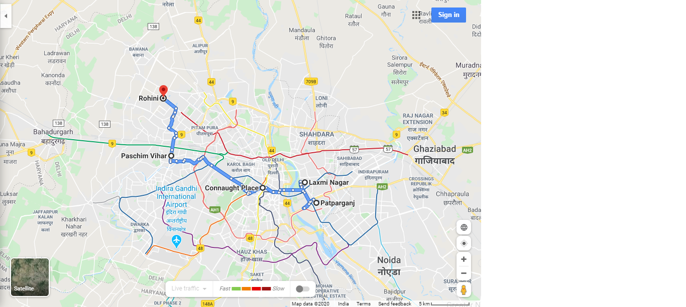
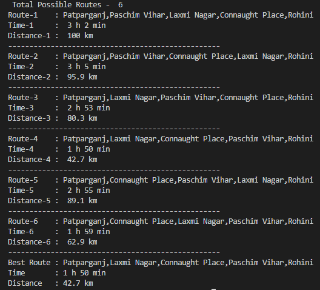

# Optimum-Path-Automation
A Google Maps Automation Script which takes Source,Destination and all the stopage as inputs and then generates a HTML file and a PDF of all the most optimum route and directions from source to destination along with their commute details.It automates the process of finding the most optimum route and saves a PDF of its Direction to your disk. 

It done using - 

 -NodeJs, Puppeteer and Chromium library

## Command
Run the bat file with edits

## Prerequisites
Install puppeteer npm i puppeteer Note: When you install Puppeteer, it downloads a recent version of Chromium.A version of Puppeteer that doesn't download Chromium by default. npm i puppeteer-core

## Note
**Enter location  in 'location.json' file and update the'.bat' File before running**

 # Working
 
 
